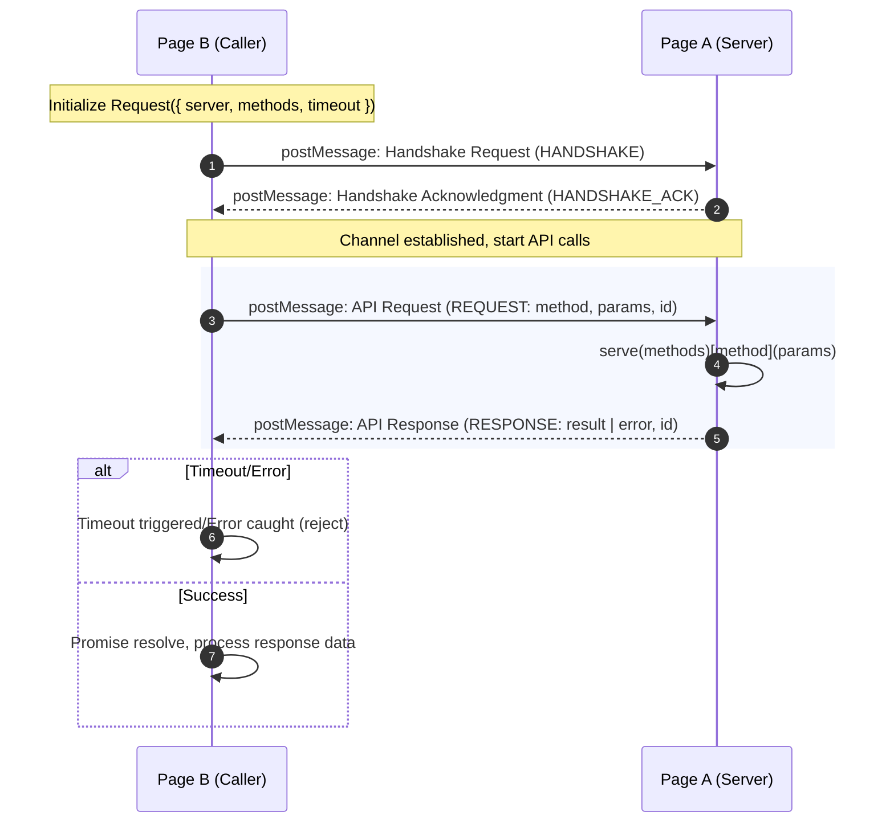

# Development

## Installation

```bash
npm install
```

## Build

```bash
npm run build
```

## Test

```bash
npm test
npm run test:watch      # Watch mode
npm run test:coverage   # With coverage
```

## Code Quality

```bash
npm run format  # Format code with Biome
npm run lint    # Lint code with Biome
npm run check   # Check and fix code
```

## Project Structure

```text
webpage-tunnel/
├── src/                # Source code (TypeScript)
│   ├── index.ts       # Main entry point
│   ├── serve.ts       # Server API implementation
│   ├── Request.ts     # Client API implementation
│   └── types.ts       # Type definitions
├── test/              # Unit tests (Jest)
│   ├── serve.test.ts
│   ├── Request.test.ts
│   └── index.test.ts
├── dist/              # Build output
│   ├── *.cjs.js      # CommonJS module
│   ├── *.esm.js      # ES module
│   ├── *.umd.js      # UMD module
│   └── *.d.ts        # TypeScript declarations
└── package.json
```

## Technical Principles


