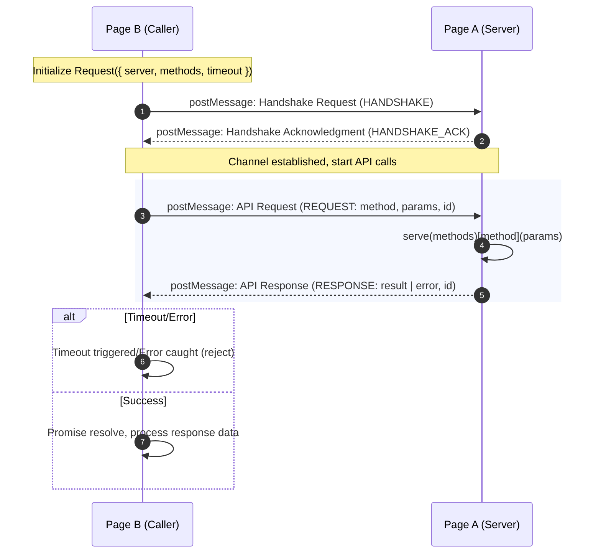

# webpage-tunnel

[](https://www.npmjs.com/package/webpage-tunnel)
[](https://github.com/yourusername/webpage-tunnel/blob/main/LICENSE)
[](https://www.npmjs.com/package/webpage-tunnel)

> A secure and elegant cross-iframe API communication library based on `postMessage`.

`webpage-tunnel` enables seamless, type-safe API calls between parent pages and iframes, eliminating the complexity of `postMessage` protocol handling. With just a few lines of code, you can establish a communication tunnel between pages.

[中文文档](./README_ZH.md)

## Use Cases

- 🔗 **Micro Frontends**: Communication between micro-applications
- 📦 **Third-party Integration**: Secure data exchange with embedded third-party pages
- 🎨 **Visual Editors**: Communication between canvas and preview iframes
- 💬 **Chat Systems**: Real-time messaging between parent and iframe chat windows
- 🎮 **Game Embedding**: API calls between game containers and game iframes

## Features

- ✨ **Simple API**: Intuitive `serve()` and `Request` API design
- 🔒 **Type Safe**: Full TypeScript support with complete type inference
- ⚡ **High Performance**: Lightweight with no dependencies (~2KB gzipped)
- 🎯 **Promise-based**: All API calls return Promises
- 🔧 **Error Handling**: Built-in timeout and error handling
- 🌐 **Cross-domain Support**: Secure communication across different domains
- 📦 **Multiple Formats**: Supports UMD, ESM, and CJS

## Installation

**NPM:**

```bash
npm install webpage-tunnel
# or
yarn add webpage-tunnel
# or
pnpm add webpage-tunnel
```

**CDN:**

```html
<script src="https://unpkg.com/webpage-tunnel/dist/webpage-tunnel.umd.js"></script>
```

## Quick Start

### Basic Usage

**Page A (Service Provider):**

```typescript
import { serve } from 'webpage-tunnel';

serve({
  // Define API methods
  async getUser(params: { id: string }) {
    return { id: params.id, name: 'Alice' };
  },
  
  async updateUser(params: { id: string; name: string }) {
    return { success: true };
  }
});
```

**Page B (API Caller):**

```typescript
import { Request } from 'webpage-tunnel';

// Create Request instance
const api = new Request({
  server: 'https://example.com/page-a',
  methods: ['getUser', 'updateUser'],
  timeout: 5000  // Optional: default 30000ms
});

// Call API methods
const user = await api.getUser({ id: '123' });
console.log(user);  // { id: '123', name: 'Alice' }

await api.updateUser({ id: '123', name: 'Bob' });

// Cleanup when done
api.destroy();
```

### Demo Example

The project includes a complete bidirectional communication demo:

```bash
cd demo
npm install
npm start
```

Then open:
- User A: http://localhost:3001
- User B: http://localhost:3002

This demo shows two pages communicating in real-time through `webpage-tunnel`.

## API Reference

<details>
<summary><h3 style="display: inline;">serve(methods)</h3></summary>

Expose API methods to allow other pages to call them.

**Parameters:**

| Parameter | Type | Required | Description |
|-----------|------|----------|-------------|
| `methods` | `Record<string, ApiHandler>` | ✅ | Object containing API methods |

**ApiHandler Type:**

```typescript
type ApiHandler<P = any, R = any> = (params: P) => R | Promise<R>
```

**Example:**

```typescript
import { serve } from 'webpage-tunnel';

serve({
  // Synchronous method
  add(params: { a: number; b: number }) {
    return params.a + params.b;
  },
  
  // Asynchronous method
  async fetchData(params: { url: string }) {
    const response = await fetch(params.url);
    return response.json();
  },
  
  // Method with complex types
  async processUser(params: { user: User }) {
    // Process user data
    return { success: true, user: params.user };
  }
});
```

**Notes:**

- `serve()` should only be called once per page
- Methods can be synchronous or asynchronous
- Methods receive a single `params` object parameter
- Methods can return any JSON-serializable value

</details>

---

<details>
<summary><h3 style="display: inline;">Request</h3></summary>

Create an API client to call remote page methods.

**Constructor Parameters:**

| Parameter | Type | Required | Default | Description |
|-----------|------|----------|---------|-------------|
| `options.server` | `string` | ✅ | - | Target page URL (must include protocol and domain) |
| `options.methods` | `string[]` | ✅ | - | List of API method names to call |
| `options.timeout` | `number` | ❌ | `30000` | Request timeout in milliseconds |

**Instance Methods:**

Request instances dynamically add methods based on `options.methods`. Each method returns a `Promise`.

| Method | Description |
|--------|-------------|
| `[methodName]<P, R>(params?: P): Promise<R>` | Call remote API with generic type support |
| `destroy(): void` | Destroy instance and cleanup resources |

**Example:**

```typescript
import { Request } from 'webpage-tunnel';

// Create Request instance
const api = new Request({
  server: 'https://example.com/page',
  methods: ['getUser', 'updateUser', 'deleteUser'],
  timeout: 5000
});

// Call method with types
interface User {
  id: string;
  name: string;
}

const user = await api.getUser<{ id: string }, User>({ id: '123' });
console.log(user.name);

// Call method without types
const result = await api.updateUser({ id: '123', name: 'John' });

// Destroy instance
api.destroy();
```

</details>

---

<details>
<summary><h3 style="display: inline;">Type Definitions</h3></summary>

#### `ApiHandler<P, R>`

API handler function type.

```typescript
type ApiHandler<P = any, R = any> = (params: P) => R | Promise<R>
```

| Generic Parameter | Description |
|-------------------|-------------|
| `P` | Parameter type |
| `R` | Return type |

---

#### `RequestOptions`

Request constructor configuration options.

```typescript
interface RequestOptions {
  server: string;      // Target page URL
  methods: string[];   // List of API method names
  timeout?: number;    // Timeout in milliseconds
}
```

---

#### `Message<T>`

Internal communication message structure (for advanced users).

```typescript
interface Message<T = any> {
  type: MessageType;   // Message type
  id: string;          // Unique message ID
  method?: string;     // API method name
  params?: T;          // Request parameters
  result?: any;        // Response result
  error?: string;      // Error message
}
```

</details>

---

<details>
<summary><h3 style="display: inline;">Error Handling</h3></summary>

All methods called through Request return Promises, so you can use `try-catch` or `.catch()` to handle errors:

**Common Errors:**

| Error Message | Description | Solution |
|---------------|-------------|----------|
| `Handshake timeout` | Connection timeout with target page | Check if target page loads correctly and calls `serve()` |
| `Request timeout: [method]` | API call timeout | Increase `timeout` or optimize server response |
| `Method [method] not found` | Called method not registered on server | Confirm method is defined in `serve()` |
| `Request cancelled` | Request cancelled (usually by calling `destroy()`) | Normal behavior, no action needed |

**Example:**

```typescript
try {
  const data = await api.getData({ id: '123' });
  console.log(data);
} catch (error) {
  if (error.message.includes('timeout')) {
    console.error('Request timeout, please try again');
  } else if (error.message.includes('not found')) {
    console.error('API method not found');
  } else {
    console.error('Request failed:', error.message);
  }
}
```

</details>

## Technical Overview

Based on the browser's native `postMessage` mechanism, `webpage-tunnel` establishes a secure communication channel between two pages. Through message passing, it implements method invocation and data exchange, ensuring data security and integrity in cross-domain environments.



## Best Practices

<details>
<summary><h3 style="display: inline;">1. Type Safety</h3></summary>

Use TypeScript and define explicit types for API methods

```typescript
interface GetUserParams { id: string }
interface UserResponse { id: string; name: string }

const user = await api.getUser<GetUserParams, UserResponse>({ id: '123' });
```

</details>

---

<details>
<summary><h3 style="display: inline;">2. Error Handling</h3></summary>

Always add error handling for API calls

```typescript
serve({
  async getData(params) {
    try {
      return await fetchData(params);
    } catch (error) {
      return { error: error.message };
    }
  }
});
```

</details>

---

<details>
<summary><h3 style="display: inline;">3. Resource Cleanup</h3></summary>

Call `destroy()` promptly when no longer needed

```typescript
// On component unmount
componentWillUnmount() {
  this.api.destroy();
}
```

</details>

---

<details>
<summary><h3 style="display: inline;">4. Timeout Configuration</h3></summary>

Set timeout appropriately based on network conditions

```typescript
const api = new Request({
  server: 'https://example.com',
  methods: ['heavyOperation'],
  timeout: 60000  // Longer timeout for heavy operations
});
```

</details>

## License

[MIT License](./LICENSE)
