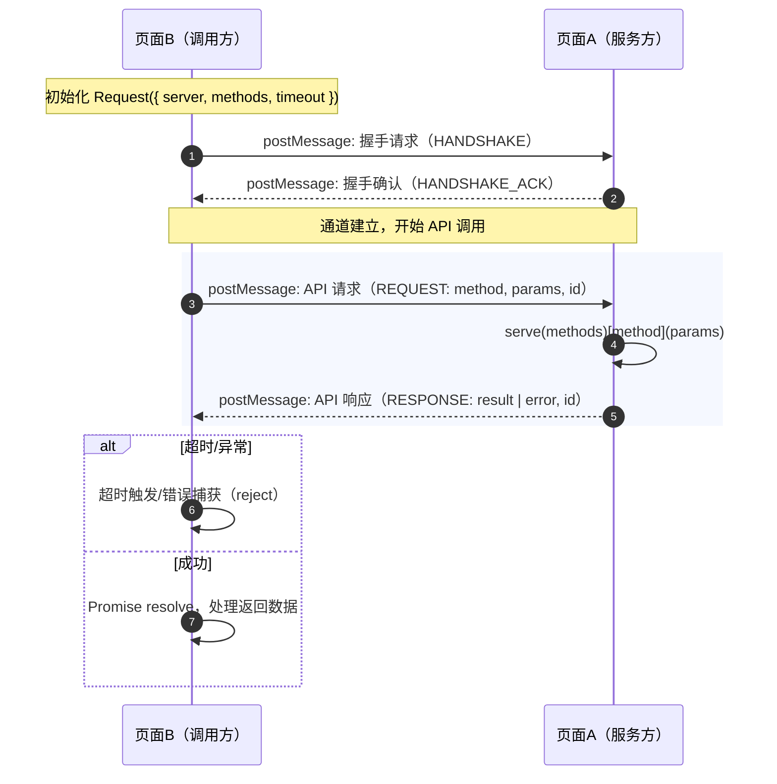

# Webpage Tunnel

[](https://www.npmjs.com/package/webpage-tunnel)
[](https://github.com/parksben/webpage-tunnel/blob/main/LICENSE)
[](https://www.npmjs.com/package/webpage-tunnel)


一个浏览器端轻量级框架，用于安全、高效地实现 iframe 内嵌网页与宿主页面间的 API 式通信。

## 适用场景

* 需要在两个独立域名的网页间实现安全的数据交换和功能调用
* 希望通过简单的 API 接口封装复杂的跨页面通信逻辑

## 功能特性

* 网页即服务：通过工厂函数 `serve()` 可将网页中的功能、逻辑封装为供其他页面调用的 API
* API 调用：通过框架提供的 `Request` 工具类，可快速实现对网页 API 的快速调用
* 双向通信：支持两个页面相互调用对方的 API，实现双向通信

## Install

NPM

```bash
npm install webpage-tunnel
# or
yarn add webpage-tunnel
# or
pnpm add webpage-tunnel
```

**CDN for Browser:**

```html
<script src="https://unpkg.com/webpage-tunnel/dist/webpage-tunnel.umd.js"></script>
<script>
  const { serve, Request } = window.WebpageTunnel;
</script>
```

**CDN for ES Module:**

```html
<script type="module">
import { serve, Request } from 'https://unpkg.com/webpage-tunnel/dist/webpage-tunnel.esm.js';
</script>
```

## QuickStart

### 1. 嵌入网页

使用 iframe 将 网页A 嵌入到 网页B 中：

```html
<!-- 网页B 的 HTML -->
<iframe src="https://a.com/profile"></iframe>
```

或者也可以使用 iframe 将 网页B 嵌入到 网页A 中：

```html
<!-- 网页A 的 HTML -->
<iframe src="https://b.com/dashboard"></iframe>
```

两种情况下 `webpage-tunnel` 框架均可正常工作。

### 2. 封装网页 API

在 网页A 中使用 `serve()` 方法封装 API（含类型）

```typescript
// Page A: profile page (https://a.com/profile)
import { serve } from 'webpage-tunnel';

interface ApiResponse<T> {
  status: number;
  message: string;
  data?: T;
}

interface RequestParams { userId: string }
interface UserInfo { id: string; name: string; email: string; avatar: string }
interface PlayListItem { id: string; title: string; cover: string }

// 使用 serve() 封装 API 方法
serve({
  getUserInfo: async ({ userId }: RequestParams): Promise<ApiResponse<UserInfo>> => {
    const { data } = await fetch(`/api/user/${userId}/info`).then(res => res.json());
    return {
      status: 1,
      message: 'Success',
      data: {
        id: userId,
        name: data.name,
        email: data.email,
        avatar: data.avatar,
      },
    };
  },
  getPlayList: async ({ userId }: RequestParams): Promise<ApiResponse<PlayListItem[]>> => {
    const { data } = await fetch(`/api/user/${userId}/playList`).then(res => res.json());
    if (Array.isArray(data) && data.length > 0) {
      return { status: 1, message: 'Success', data };
    }
    return { status: 0, message: 'Play list is empty', data: [] };
  },
});
```

### 3. 调用网页 API

在 网页B 中使用 `Request` 实例来调用 网页A 中封装的 API（含泛型）

```typescript
// Page B: dashboard page (https://b.com/dashboard)
import { Request } from 'webpage-tunnel';

// 复用上文的类型：ApiResponse、RequestParams、UserInfo、PlayListItem

// 创建 Request 实例
const userApi = new Request({
  server: 'https://a.com/profile',              // 目标页面 URL
  methods: ['getUserInfo', 'getPlayList'],      // 需要调用的 API 方法列表
  timeout: 10 * 1000,                           // 可选：请求超时（ms）
});

// 定义请求入参
const params: RequestParams = { userId: '123' };

// 调用 API 方法
userApi
  .getUserInfo<RequestParams, ApiResponse<UserInfo>>(params)
  .then(({ data }) => {
    console.log('User Info:', data);
  })
  .catch((error) => {
    console.error(error);
  });

userApi
  .getPlayList<RequestParams, ApiResponse<PlayListItem[]>>(params)
  .then(({ data }) => {
    console.log('Play List:', data);
  })
  .catch((error) => {
    console.error(error);
  });
```

## API Reference

### serve(methods)

将当前网页的功能封装为 API，供其他页面通过 `Request` 调用。

| 参数 | 类型 | 必填 | 说明 |
|------|------|------|------|
| `methods` | `ApiMethods` | ✅ | API 方法集合，键为方法名，值为处理函数 |

**ApiMethods 类型定义：**

```typescript
type ApiMethods = Record<string, (params: any) => any | Promise<any>>
```

**示例：**

```typescript
import { serve } from 'webpage-tunnel';

serve({
  // 同步方法
  getConfig: () => {
    return { theme: 'dark', lang: 'zh-CN' };
  },
  
  // 异步方法
  fetchData: async (params) => {
    const response = await fetch(`/api/data?id=${params.id}`);
    return response.json();
  },
  
  // 带错误处理
  updateUser: async (params) => {
    try {
      const result = await updateUserAPI(params);
      return { success: true, data: result };
    } catch (error) {
      return { success: false, error: error.message };
    }
  }
});
```

---

### new Request(options)

创建一个请求客户端实例，用于调用其他页面通过 `serve()` 封装的 API。

**构造函数参数：**

| 参数 | 类型 | 必填 | 默认值 | 说明 |
|------|------|------|--------|------|
| `options.server` | `string` | ✅ | - | 目标页面的 URL（必须包含协议和域名） |
| `options.methods` | `string[]` | ✅ | - | 要调用的 API 方法名列表 |
| `options.timeout` | `number` | ❌ | `30000` | 请求超时时间（毫秒） |

**实例方法：**

Request 实例会根据 `options.methods` 动态添加对应的方法。每个方法都返回 `Promise`。

| 方法 | 说明 |
|------|------|
| `[methodName]<P, R>(params?: P): Promise<R>` | 调用远程 API，支持泛型指定参数和返回值类型 |
| `destroy(): void` | 销毁实例，清理资源和事件监听器 |

**示例：**

```typescript
import { Request } from 'webpage-tunnel';

// 创建请求实例
const api = new Request({
  server: 'https://example.com/page',
  methods: ['getUser', 'updateUser', 'deleteUser'],
  timeout: 5000
});

// 调用方法（带类型）
interface User {
  id: string;
  name: string;
}

const user = await api.getUser<{ id: string }, User>({ id: '123' });
console.log(user.name);

// 调用方法（不带类型）
const result = await api.updateUser({ id: '123', name: 'John' });

// 销毁实例
api.destroy();
```

---

### 类型定义

#### `ApiHandler<P, R>`

API 处理函数类型。

```typescript
type ApiHandler<P = any, R = any> = (params: P) => R | Promise<R>
```

| 泛型参数 | 说明 |
|----------|------|
| `P` | 参数类型 |
| `R` | 返回值类型 |

---

#### `RequestOptions`

Request 构造函数配置选项。

```typescript
interface RequestOptions {
  server: string;      // 目标页面 URL
  methods: string[];   // API 方法名列表
  timeout?: number;    // 超时时间（毫秒）
}
```

---

#### `Message<T>`

内部通信消息结构（供高级用户参考）。

```typescript
interface Message<T = any> {
  type: MessageType;   // 消息类型
  id: string;          // 消息唯一 ID
  method?: string;     // API 方法名
  params?: T;          // 请求参数
  result?: any;        // 响应结果
  error?: string;      // 错误信息
}
```

---

### 错误处理

所有通过 Request 调用的方法都返回 Promise，可以使用 `try-catch` 或 `.catch()` 捕获错误：

**常见错误：**

| 错误信息 | 说明 | 解决方案 |
|----------|------|----------|
| `Handshake timeout` | 与目标页面建立连接超时 | 检查目标页面是否正确加载，是否调用了 `serve()` |
| `Request timeout: [method]` | API 调用超时 | 增加 `timeout` 配置或优化服务端响应速度 |
| `Method [method] not found` | 调用的方法在服务端未注册 | 确认服务端 `serve()` 中已定义该方法 |
| `Request cancelled` | 请求被取消（通常因为调用了 `destroy()`） | 正常情况，无需处理 |

**示例：**

```typescript
try {
  const data = await api.getData({ id: '123' });
  console.log(data);
} catch (error) {
  if (error.message.includes('timeout')) {
    console.error('请求超时，请稍后重试');
  } else if (error.message.includes('not found')) {
    console.error('API 方法不存在');
  } else {
    console.error('请求失败:', error.message);
  }
}
```

---

## 技术原理

基于浏览器原生的 `postMessage` 机制，`webpage-tunnel` 框架在两个页面间建立安全的通信通道。通过消息传递实现方法调用和数据交换，确保跨域环境下的数据安全性和完整性。



## 最佳实践

### 1. 类型安全

使用 TypeScript 并为 API 方法定义明确的类型

```typescript
interface GetUserParams { id: string }
interface UserResponse { id: string; name: string }

const user = await api.getUser<GetUserParams, UserResponse>({ id: '123' });
```

---

### 2. 错误处理

始终为 API 调用添加错误处理

```typescript
serve({
  async getData(params) {
    try {
      return await fetchData(params);
    } catch (error) {
      return { error: error.message };
    }
  }
});
```

---

### 3. 资源清理

在不需要时及时调用 `destroy()` 清理资源

```typescript
// 组件卸载时
componentWillUnmount() {
  this.api.destroy();
}
```

---

### 4. 超时配置

根据实际网络情况合理设置超时时间

```typescript
const api = new Request({
  server: 'https://example.com',
  methods: ['heavyOperation'],
  timeout: 60000  // 耗时操作可设置更长超时
});
```

---

## License

[MIT License](./LICENSE)
